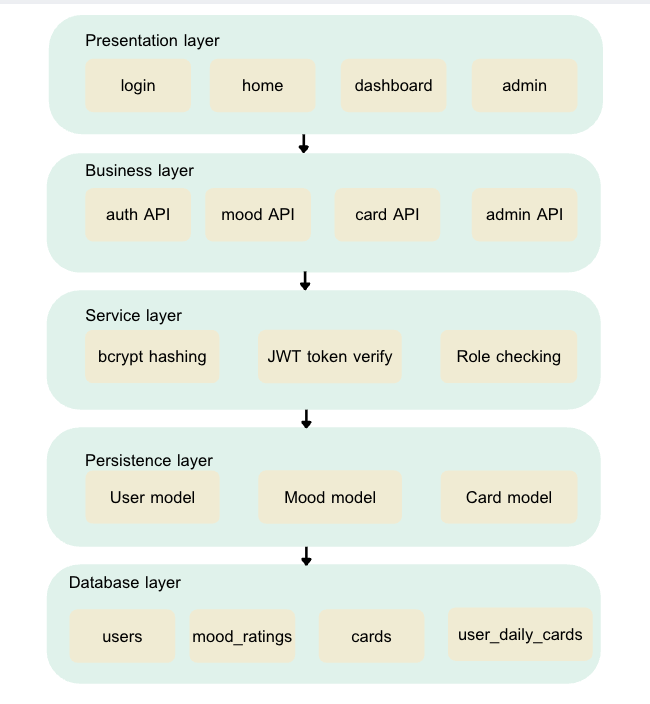
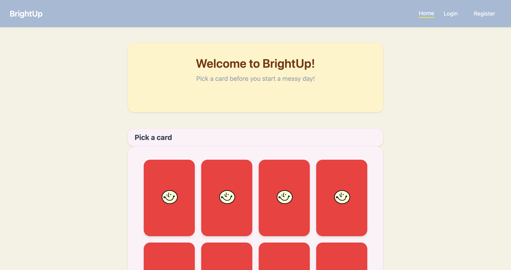
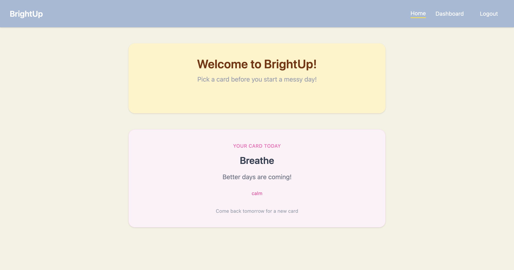
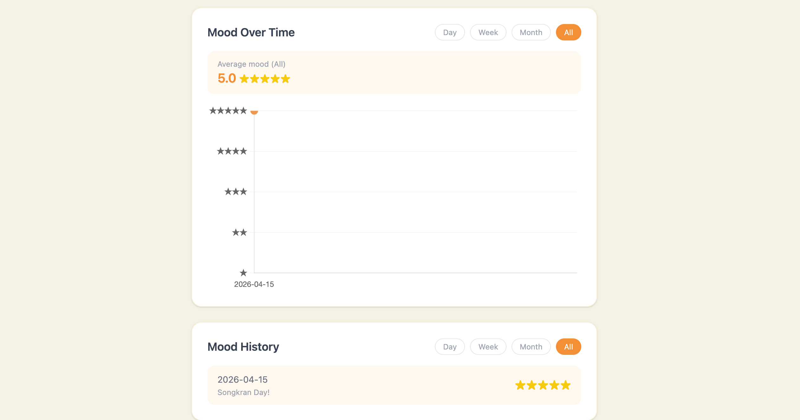
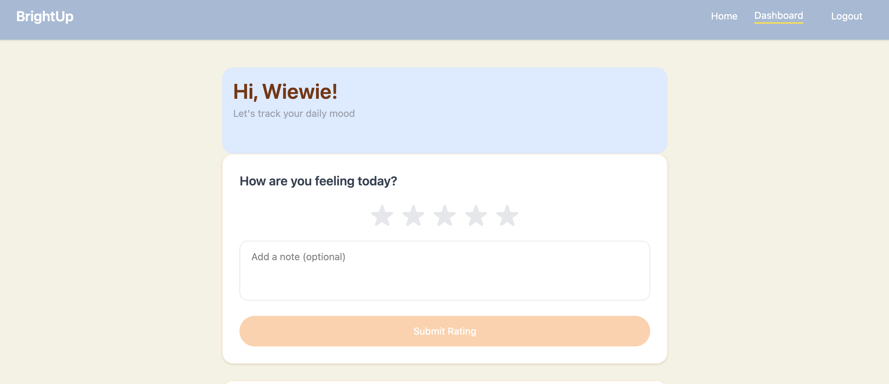
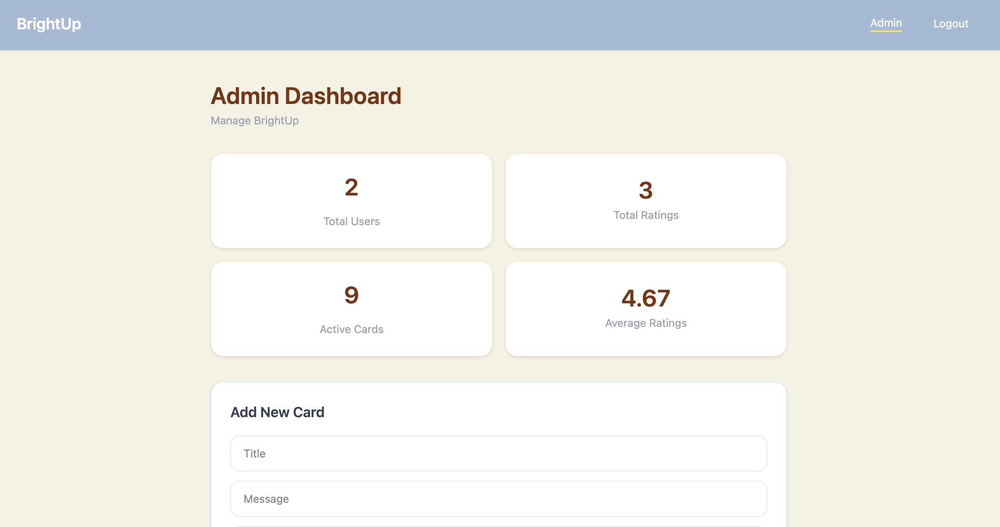
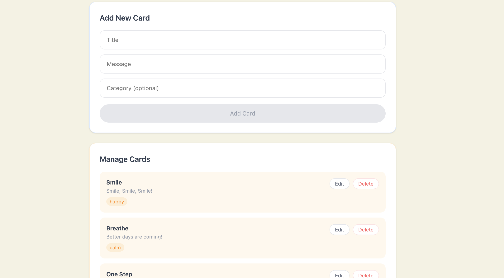

# BrightUp 🌟

A mood tracking and daily motivation app designed to help users improve their mental wellness through daily mood logging, inspirational messages, and mood analytics.

## Project Description

**BrightUp** is a web-based application that combines mood tracking with daily motivational cards. Users can:
- Track their daily mood on a 1-5 scale
- Add personal notes to their mood entries
- Receive a inspirational card each day
- View mood trends and analytics on their dashboard
- Admins can manage motivational content

The app promotes mental wellness by encouraging daily self-reflection and providing personalized motivational support.

---

## System Architecture

BrightUp follows a 5-tier layered architecture where each layer 
communicates only with the layer directly below it.



---

## User Roles & Permissions

### 1. Guest User
- Browse and pick a random motivational card
- Card selection is not saved to the database
- Cannot access mood tracking or personal dashboard

### 2. Regular User
- Register and login to the app
- Track daily mood (1–5 stars) with an optional reflection note
- Pick and save one motivational card per day
- Access personal dashboard with mood history and trends

### 3. **Admin**
- Access to admin panel
- Create, edit, and delete motivational cards
- View analytics on user engagement
- Activate/deactivate cards

---

## Technology Stack

| Layer | Technology | Purpose |
|-------|-----------|---------|
| Presentation | Vue.js 3 + Tailwind CSS | Pages: Login, Dashboard, MoodRate, Admin |
| Business | FastAPI routers (Python) | auth API, mood API, card API endpoints |
| Service | bcrypt, python-jose | Password hashing, JWT token creation and validation |
| Persistence | SQLAlchemy ORM | Save and retrieve data from database |
| Database | MySQL 8.0 | Tables: users, mood_rating, cards, user_daily_cards |
---

## Installation & Setup

### **Prerequisites**
- Docker & Docker Compose installed

### **Option 1: Using Docker**

1. **Clone/Navigate to project directory:**
   ```bash
   cd BrightUp
   ```

2. **Build and start all services:**
   ```bash
   docker-compose up --build
   ```

3. **Wait for services to be healthy:**
   - MySQL: Port 3306
   - Backend: Port 8000
   - Frontend: Port 80

4. **Access the application:**
   - Frontend: `http://localhost`
   - API Docs: `http://localhost:8000/docs` (Swagger UI)

## How to Run

### **Using Docker**

```bash
# Start the entire system
docker-compose up

# Stop the system
docker-compose down

```


### **Access Points**

| Service | URL | Purpose |
|---------|-----|---------|
| Frontend | `http://localhost` | Web application |
| API Docs | `http://localhost:8000/docs` | Interactive API documentation |
| Backend API | `http://localhost:8000` | REST API endpoint |
| Database | `localhost:3306` | MySQL database |

### **Default Admin Account**
```
Username: admin
Email: admin@brightup.com
Password: admin123
```

---

## Screenshots

### Home Page
The landing page where guest users can pick a random motivational card. 
Guest users can reshuffle to select a different card without logging in.

### Daily Card
Shows the logged-in user's assigned motivational card for the day.
Each user receives one card per day, saved to their account.


### User Dashboard
Displays mood trends over time with filterable charts, 
allowing users to view their mood history by date range.


### Daily Mood Tracker
Simple interface for logged-in users to log their daily mood (1–5 stars) 
with an optional personal reflection note.


### Admin Panel
Management interface for administrators to view system-wide statistics

and manage motivational cards (add, edit, and delete).

